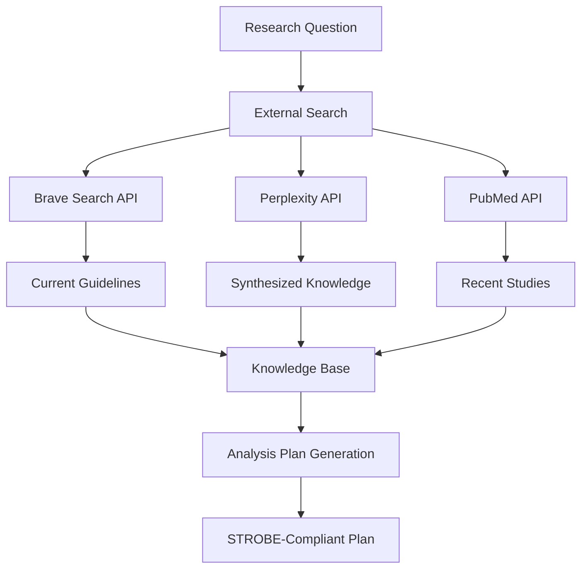

# External Search Workflow

## How the MCP Server Uses External APIs Before Creating Analysis Plans

The Healthcare Research MCP Server uses external search APIs (Brave, Perplexity) to gather the most current medical information before creating analysis plans. This ensures that research designs are based on the latest evidence and guidelines.

## Workflow Overview



## Step-by-Step Process

### 1. Initial Query Processing
When you ask: *"Using this dataset I have uploaded, define sepsis, provide descriptive statistics, and see if the medication vancomycin reduces sepsis mortality at 30 days"*

The system identifies key concepts:
- **Condition**: Sepsis
- **Medication**: Vancomycin  
- **Outcome**: 30-day mortality
- **Analysis Type**: Comparative effectiveness

### 2. External Search Phase

#### A. Search for Sepsis Information
```javascript
await search_external_sources({
  query: "sepsis definition diagnosis criteria Sepsis-3 2024",
  search_type: "clinical_guidelines",
  providers: ["brave", "perplexity"]
})
```

Returns:
- Latest Sepsis-3 criteria
- Current clinical guidelines
- Recent changes in definitions

#### B. Search for Vancomycin Effectiveness
```javascript
await search_external_sources({
  query: "vancomycin sepsis mortality outcomes 2023 2024",
  search_type: "medical_research",
  providers: ["brave", "pubmed_api"]
})
```

Returns:
- Recent clinical trials
- Meta-analyses results
- Real-world evidence studies

#### C. Search for OMOP/CLIF Examples
```javascript
await search_external_sources({
  query: "OMOP CDM sepsis phenotype implementation",
  search_type: "data_standards",
  providers: ["brave"]
})
```

Returns:
- Validated phenotype definitions
- Code lists from other studies
- Implementation best practices

### 3. Knowledge Synthesis

The external search results are synthesized to inform:

#### Statistical Methods
- Recent studies using propensity score matching → Include in analysis
- Time-dependent bias concerns → Add immortal time bias correction
- Missing data patterns → Plan for multiple imputation

#### Clinical Considerations  
- Antibiotic timing critical (within 3 hours) → Add time variables
- Severity adjustment needed → Include SOFA scores
- Source of infection matters → Stratify by infection source

#### Data Model Implementation
- OMOP tables to use: CONDITION_OCCURRENCE, DRUG_EXPOSURE
- Timing variables: drug_exposure_start_datetime
- Outcome definition: death table or discharge disposition

### 4. Analysis Plan Generation

The system then creates an analysis plan that incorporates:

1. **Current Clinical Definitions**
   - Sepsis: Suspected infection + SOFA ≥2 (from guidelines search)
   - Include qSOFA for screening (from recent evidence)

2. **Evidence-Based Methods**
   - Cox regression for mortality (standard in recent studies)
   - Propensity scores for confounding (recommended in searches)
   - Sensitivity analyses (addressing concerns from literature)

3. **STROBE Compliance**
   - All elements checked against current standards
   - Missing elements identified and added

## Configuration

### Required API Keys

Add to your `.env` file:

```bash
# Brave Search API (https://brave.com/search/api/)
BRAVE_API_KEY=your_brave_api_key_here

# Perplexity API (https://www.perplexity.ai/api) 
PERPLEXITY_API_KEY=your_perplexity_api_key_here
```

### Optional APIs

```bash
# For direct PubMed access (free, no key needed)
# Uses NCBI E-utilities

# For ClinicalTrials.gov (free, no key needed)
# Uses public API
```

## API Features

### Brave Search
- **Advantages**: Fast, comprehensive web search
- **Use Cases**: Guidelines, recent news, medical websites
- **Freshness**: Can filter by time (day, week, month, year)
- **Medical Sites**: Automatically identifies medical domains

### Perplexity API
- **Advantages**: AI-synthesized answers with sources
- **Use Cases**: Complex medical questions, summarization
- **Models**: Uses online models for current information
- **Citations**: Provides sources for verification

### Fallback Behavior
If APIs are not configured:
- Returns mock data for testing
- Uses built-in medical knowledge base
- Warns user about using cached information

## Example: Complete Workflow

```javascript
// 1. User asks about sepsis and vancomycin
const question = "Study vancomycin effectiveness in sepsis";

// 2. System searches external sources
const searches = await Promise.all([
  searchBrave("sepsis vancomycin mortality 2024"),
  searchPerplexity("vancomycin sepsis effectiveness evidence"),
  searchPubMed("vancomycin[mesh] AND sepsis[mesh] AND mortality")
]);

// 3. Synthesize findings
const synthesis = {
  current_evidence: "Mixed results, timing crucial",
  key_confounders: ["severity", "source", "timing"],
  recommended_methods: ["propensity matching", "cox regression"]
};

// 4. Generate analysis plan
const plan = await generateAnalysisPlan({
  ...synthesis,
  strobe_compliant: true,
  data_model: "OMOP"
});
```

## Benefits of External Search

1. **Current Information**: Gets latest guidelines and evidence
2. **Real-World Context**: Finds how others implemented similar studies
3. **Methodological Updates**: Discovers new statistical approaches
4. **Validation**: Cross-references multiple sources
5. **OMOP/CLIF Examples**: Finds actual implementations

## Testing the Workflow

Run the example:
```bash
node examples/search-before-analysis.js
```

This demonstrates:
- How external search works
- What information is gathered
- How it influences the analysis plan
- Complete workflow from question to plan

## Privacy and Security

- API calls only send search queries, not patient data
- Results are cached to minimize API calls
- Can be disabled for sensitive research
- All searches are logged for audit

The external search capability ensures that every analysis plan is based on the most current medical evidence and best practices!